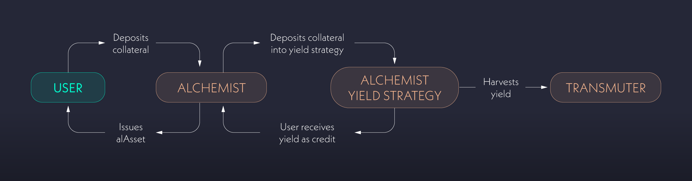

# ⚗️ Alchemist

The Alchemists are the core smart contracts responsible for managing user accounts in Alchemix. They’re used for depositing tokens, minting synthetic assets (alAssets), withdrawing tokens, engaging in yield strategies, and repaying debt.

Alchemist contracts primarily manage yield strategies and distribute harvested yield to depositors. When users deposit funds, they can borrow by minting alAssets.

alAssets can be exchanged for other tokens or used in DeFi protocols. Users may repay debt using underlying tokens or alAssets.

Each Alchemist issues a single alAsset but can support multiple yield strategies. For example, the alUSD Alchemist issues alUSD but can accept yield-bearing tokens from approved stablecoins.

<figure><figcaption>
The Alchemist contracts utilize your deposits to harvest yield.
</figcaption></figure>


Each alAsset on each chain is managed by a dedicated Alchemist. Learn more: [alchemix-on-l2.md](alchemix-on-l2.md "mention")


## Key Features

### Diverse Yield Strategies

Alchemists accept yield-bearing assets as collateral, and may also accept underlying tokens that are converted to third-party yield tokens before deposit. Supported collateral includes ETH-denominated tokens and stablecoins.

### Minting

Users mint alAssets by depositing collateral, effectively taking out a loan. The alAsset minted increases debt by the borrowed amount against collateral.

### Flexible Withdrawals

Users can withdraw underlying assets subject to a minimum collateral-to-debt ratio of **2:1** (200%). Withdrawals that would drop below this ratio are disallowed.

To withdraw collateral after borrowing, users can:
- **Repay Debt:** Repay using alAssets (alUSD/alETH) or the underlying assets. Repaying with alAssets burns them and removes debt.
- **Wait for Yield:** Harvested yield reduces debt over time, increasing withdrawable collateral or borrowing capacity.
- **Self-Liquidate:** Use deposited collateral to repay debt while maintaining the 2:1 ratio.

<figure><figcaption></figcaption></figure>

## How It Works

Example with **DAI → alUSD** using the **Yearn DAI yVault** (process is analogous for other supported stablecoins and ETH strategies):

1. **Depositing Assets:** Users deposit yield-bearing assets or underlying tokens. If underlying is deposited, the protocol converts to the yield token before depositing.  
   - *Example:* Deposit DAI → convert to yvDAI via Yearn → deposit yvDAI.
2. **Earning & Borrowing:** Users borrow alAssets against deposits (up to **50%** LTV; **200%** collateralization minimum).  
   - *Example:* For every 2 DAI deposited, up to 1 alUSD can be borrowed.
3. **Yield Harvesting:** Deposits are placed in yield strategies. Harvested yield pays down debt and increases borrowing capacity.  
   - *Example:* yvDAI yield is harvested and proportionally applied to reduce each user’s alUSD debt (or increases borrow limit if no debt).
4. **Debt Management & Repayment:** Debt can be repaid anytime using alAssets or underlying. As debt decreases, users can withdraw more collateral while maintaining 200% collateralization. Buying alAssets below $1 on AMMs allows discounted repayment.  
   - *Example:* alUSD debt can be repaid with alUSD, DAI, USDC, or USDT; alUSD < $1 lets users repay at a discount.
5. **Self-Liquidation:** Users who lack capital to repay can self-liquidate—using collateral to settle debt—then withdraw the remainder.  
   - *Example:* Repay alUSD debt using DAI from yvDAI collateral and withdraw leftover collateral.
6. **Harvesting Fees:** Harvested yield is sent from Alchemists to the [Transmuter](https://alchemix-finance.gitbook.io/user-docs/alchemix-ecosystem/transmuter). Alchemix charges a **10%** fee on generated yield; **90%** pays down user debt or increases debt allowance.

Alchemists provide a flexible line of credit against future yield. Users can enter and exit at any time with no forced liquidations—only self-liquidation is possible—because debt only trends downward as yield accrues.

Alchemix has multiple [audits](https://alchemix-finance.gitbook.io/user-docs/resources/audits-and-reports), an ongoing [bug bounty](https://immunefi.com/bounty/alchemix/), and internal security reviews with risk monitoring.

### To Protect Deposits, Alchemists Incorporate:

- **Collateral Deposit Caps:** Limit alAsset supply and exposure to any single yield source.
- **Operational Safeguards:** **Maximum Loss**, **Repay Cap**, and **Liquidate Cap** parameters guard against instability.  
  - **Maximum Loss:** Caps loss in a yield strategy; if exceeded, the strategy auto-pauses for evaluation. See [multisig admin rights](../alchemix-dao/the-alchemix-dao/governance-process/multisig-admin-rights.md).  
  - **Repay & Liquidate Caps:** Time-bound limits on debt repayment and collateral liquidation to mitigate potential exploits.


For more details, see [Vault Losses and Collateral De-pegging](../resources/guides/vault-losses-and-collateral-de-pegging.md).


<figure><figcaption></figcaption></figure>
